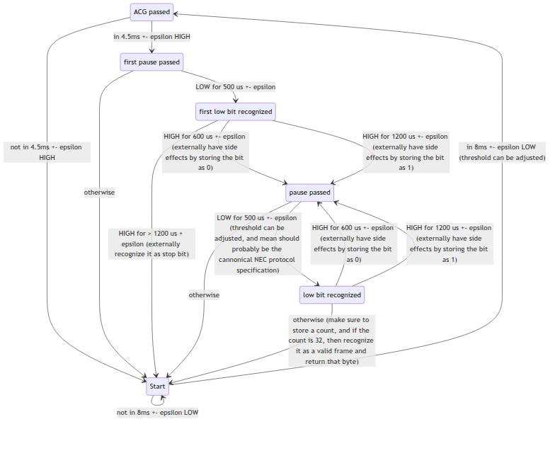

# NEC protocol

For a typical NEC command (assuming that it has already been demodulated and that it's active HIGH), we first:

- receive an AGC pulse for 8 ms. (LOW)
- pull back high for around 4.5ms
- Now we send the 32 bit command, which is represented as such:
  - we have a 1ms cycle
  - 0 means: around 500 microseconds LOW (need to accept even shorter just in case), 600 microseconds HIGH 
  - 1 means: around 500 microseconds LOW, 1700 microseconds HIGH

- afterwards, we have a stop bit of 500 microseconds

Now, the IR protocol is incredibly unreliable, so our error checking is going to be extremely weird.

Essentially, we can state that if we don't receive the AGC pulse and the 4.5ms pause, we don't enter another the decoding state.

I think we can represent this using a state machine, even though it's a bit weird.

